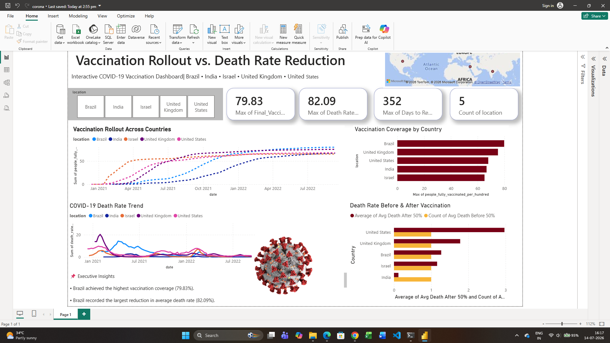

# 🦠 COVID-19 Vaccination Rollout vs. Death Rate Reduction Dashboard

## 📌 Project Overview

This project analyzes the impact of COVID-19 vaccination rollout on death rate reduction across five countries using Python, Pandas, DAX, and Power BI.

---

## 🌍 Countries

- 🇧🇷 Brazil
- 🇮🇳 India
- 🇮🇱 Israel
- 🇬🇧 United Kingdom
- 🇺🇸 United States

---

## 🛠️ Tools Used

- Python
- Pandas
- NumPy
- Jupyter Notebook
- Power BI
- DAX

---

## 📊 Dashboard Preview

---

## 📈 Dashboard Features

- Interactive Country Filter
- KPI Cards
- Vaccination Rollout Trend
- Death Rate Trend
- Vaccination Coverage Comparison
- Before vs After Vaccination Analysis
- Interactive Map
- Executive Insights

---

## 📌 Key Insights

- Brazil achieved the highest vaccination coverage.
- Brazil showed the largest reduction in average death rate.
- Vaccination coverage increased consistently across all countries.
- Death rates generally declined after vaccination rollout accelerated.

---

## 📂 Project Files

- COVID19_Vaccination_Dashboard.pbix
- COVID19_Vaccination_Dashboard.pdf
- clean_covid_vaccination_data.csv
- covid_analysis.ipynb

---

## 👨‍💻 Author

**Sahil Raj**

Aspiring Data Analyst
